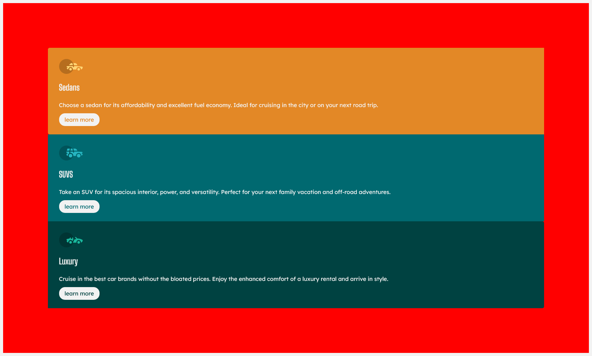

# 3 column preview

## captura de pantalla

## soluciones
[Ir a Github](https://github.com/lonrom/fronted-mentor-3-columnas)
[pagina en vivo](https://lonrom.github.io/fronted-mentor-3-columnas/)

## Tecnologías utilizadas
1. CSS Flex
2. HTML